# 🛍️ ShopAssist AI

An AI-powered E-Commerce Customer Support Assistant built using Retrieval-Augmented Generation (RAG), ChromaDB, Sentence Transformers, FastAPI, Streamlit, Docker, and Google Gemini 2.0 Flash.

The system allows users to ask questions about company policies, products, shipping, refunds, warranties, and FAQs. Relevant information is retrieved from internal documents and used to generate accurate responses.

---

# 🚀 Features

* Retrieval-Augmented Generation (RAG)
* PDF Document Ingestion
* Semantic Search using Embeddings
* ChromaDB Vector Database
* Google Gemini 2.0 Flash Integration
* FastAPI Backend
* Streamlit Frontend
* Dockerized Deployment
* Metadata-based Retrieval
* Production-Oriented Modular Architecture

---

# 🏗️ System Architecture

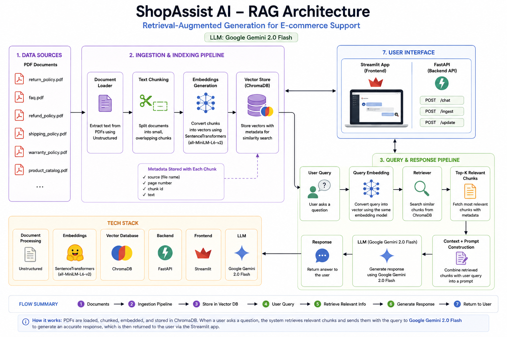

---

# 📸 FastAPI Backend Screenshots

### Swagger UI

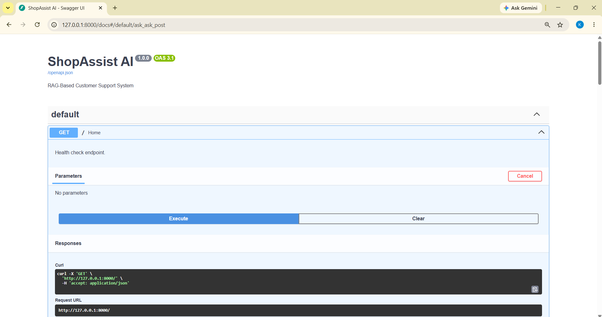

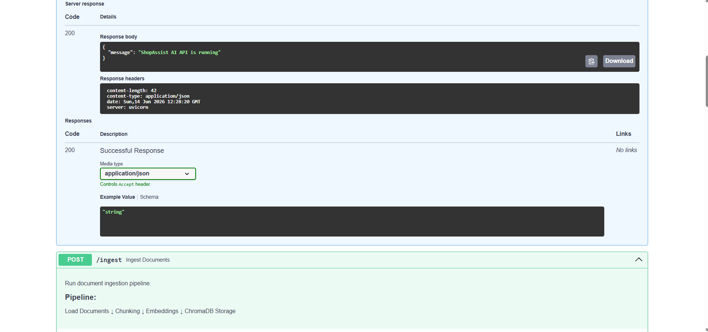

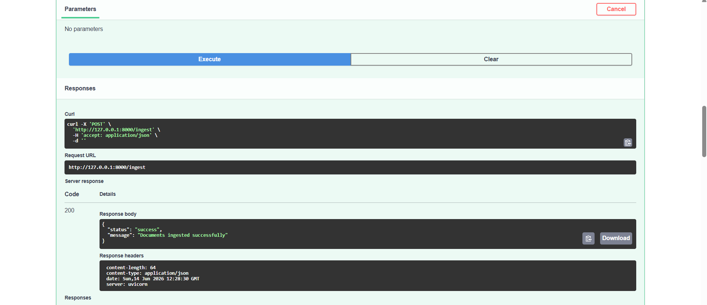

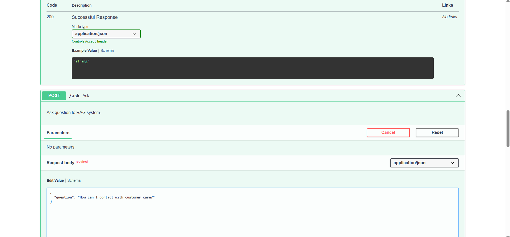

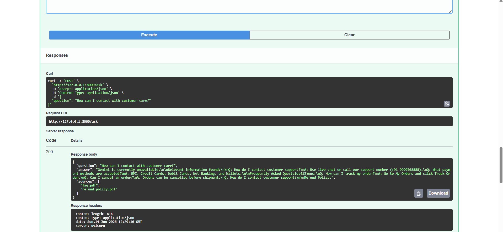

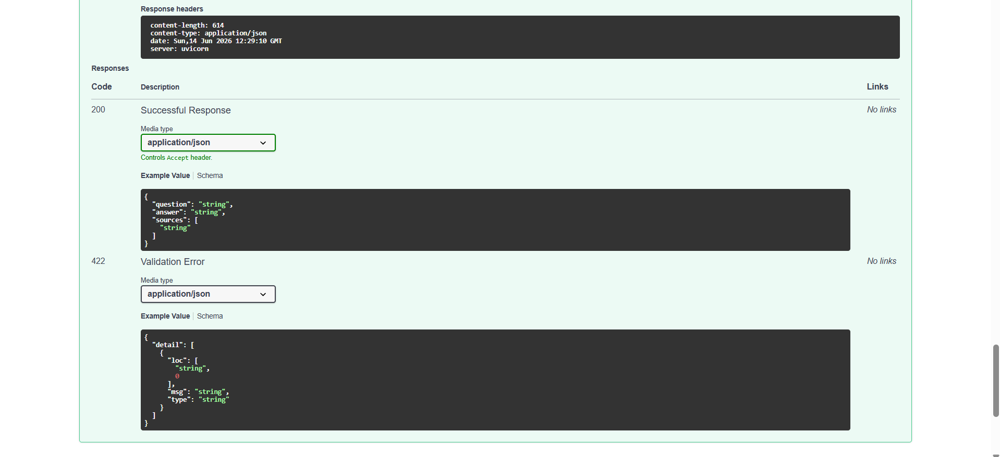

---

# 📸 Streamlit Frontend Screenshots

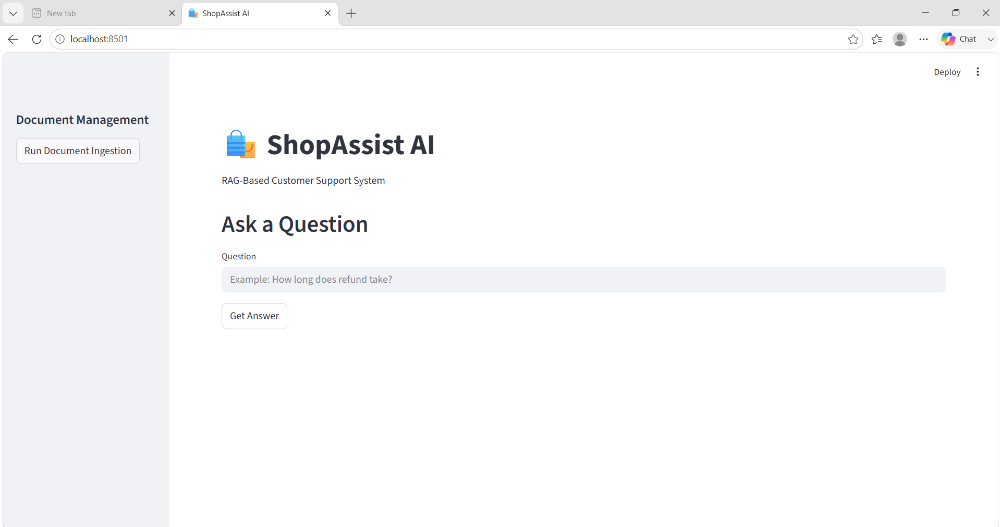

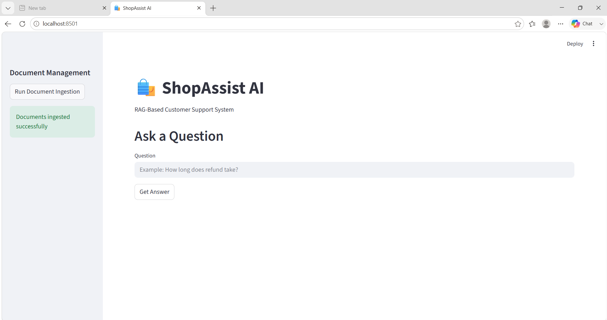

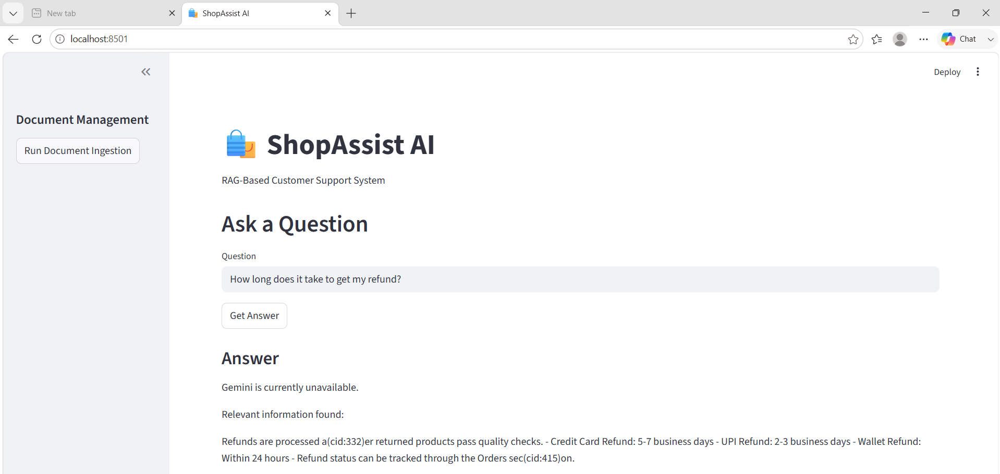

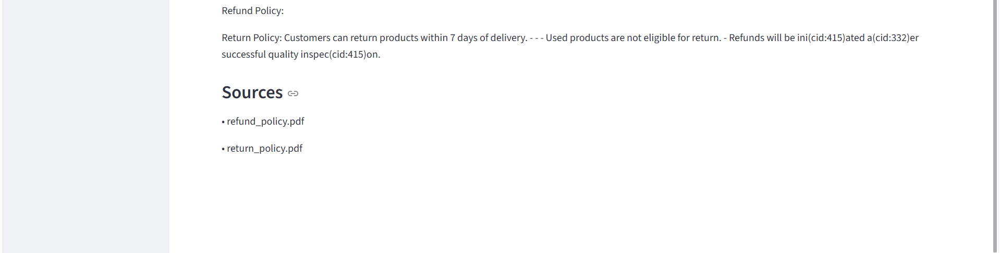

---

# 🛠️ Tech Stack

| Component           | Technology              |
| ------------------- | ----------------------- |
| Frontend            | Streamlit               |
| Backend             | FastAPI                 |
| LLM                 | Google Gemini 2.0 Flash |
| Embeddings          | Sentence Transformers   |
| Vector Database     | ChromaDB                |
| Document Processing | Unstructured            |
| Chunking            | LangChain               |
| Containerization    | Docker                  |
| Language            | Python                  |

---

# 📂 Project Structure

```text
ShopAssistAI/
│
├── client_docs/
│
├── vectorstores/
│
├── backend/
│   ├── config.py
│   ├── document_loader.py
│   ├── chunking.py
│   ├── embeddings.py
│   ├── vectorstore.py
│   ├── ingestion_pipeline.py
│   ├── update_pipeline.py
│   ├── retrieval.py
│   ├── llm_service.py
│   └── rag_pipeline.py
│
├── api/
│   ├── schemas.py
│   └── main.py
│
├── frontend/
│   └── streamlit_app.py
│
├── assets/
│
├── .env
├── requirements.txt
├── Dockerfile
├── .dockerignore
└── README.md
```

---

# ⚙️ Installation

## 1. Clone Repository

```bash
git clone https://github.com/KaushalGumphalwar/ShopAssistAI.git

cd ShopAssistAI
```

---

## 2. Create Virtual Environment

### Conda

```bash
conda create -n shopassist_env python=3.10

conda activate shopassist_env
```

---

## 3. Install Dependencies

```bash
pip install -r requirements.txt
```

---

## 4. Configure Environment Variables

Create a `.env` file in the project root directory:

```env
GOOGLE_API_KEY=your_gemini_api_key
```

---

# ▶️ Running FastAPI Backend

Start the FastAPI server:

```bash
uvicorn api.main:app --reload
```

Backend URL:

```text
http://localhost:8000
```

Swagger Documentation:

```text
http://localhost:8000/docs
```

---

# ▶️ Running Streamlit Frontend

Open a new terminal and run:

```bash
streamlit run frontend/streamlit_app.py
```

Frontend URL:

```text
http://localhost:8501
```

---

# 📥 Document Ingestion

The ingestion pipeline performs:

1. Load PDF documents
2. Extract text
3. Create chunks
4. Generate embeddings
5. Store embeddings in ChromaDB

Use Swagger UI:

```text
POST /ingest
```

---

# ❓ Ask Questions

Use:

```text
POST /ask
```

Example Request:

```json
{
    "question": "How can I return my order?"
}
```

Example Response:

```json
{
    "question": "How can I return my order?",
    "answer": "Customers can return products within 7 days of delivery.",
    "sources": ["return_policy.pdf"]
}
```

---

# 🐳 Docker Deployment

## Build Docker Image

```bash
docker build -t shopassist-ai .
```

---

## Run Docker Container

```bash
docker run \
-p 8000:8000 \
-p 8501:8501 \
--env-file .env \
--name shopassist-container \
shopassist-ai
```

---

## Access Application

### FastAPI

```text
http://localhost:8000/docs
```

### Streamlit

```text
http://localhost:8501
```

---

## Stop Container

```bash
docker stop shopassist-container
```

---

## Start Existing Container

```bash
docker start shopassist-container
```

---

## Remove Container

```bash
docker rm shopassist-container
```

---

## Remove Docker Image

```bash
docker rmi shopassist-ai
```

---

# 🔄 RAG Workflow

```text
Client Documents
       ↓
Document Loader
       ↓
Chunking
       ↓
Embeddings Generation
       ↓
ChromaDB Storage
       ↓
User Query
       ↓
Query Embedding
       ↓
Similarity Search
       ↓
Top-K Relevant Chunks
       ↓
Gemini 2.0 Flash
       ↓
Final Response
```

---

# 🔮 Future Enhancements

* DOCX Support
* PPTX Support
* XLSX Support
* Hybrid Search
* Re-ranking
* Multi-user Support
* Authentication
* Cloud Deployment
* Conversation Memory
* Admin Dashboard

---

# 👨‍💻 Author

**Kaushal Gumphalwar**

Machine Learning | Generative AI | RAG Systems | FastAPI | Docker

GitHub: https://github.com/KaushalGumphalwar

---

# ⭐ If you found this project useful

Please consider giving this repository a star.